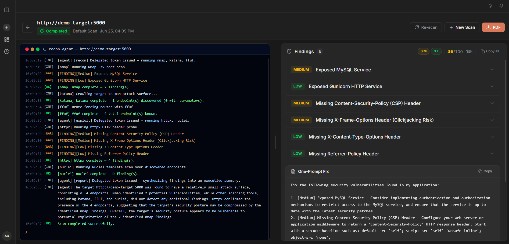
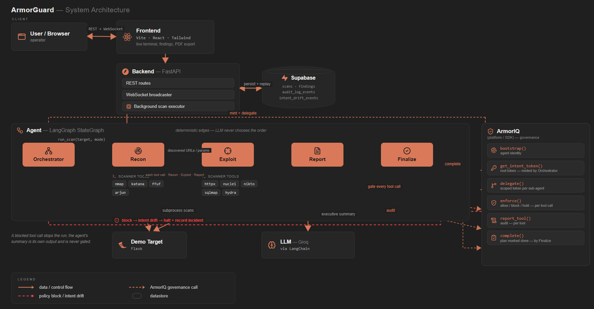

<h1 align="center">ArmorGuard</h1>

<p align="center">
  <strong>Live at <a href="https://armor-guard.vercel.app">armor-guard.vercel.app</a> — enter a target and scan now.</strong>
</p>

<p align="center">
  
</p>

Autonomous AI pentesting agent that probes web applications for security vulnerabilities and generates severity-scored, enterprise-grade forensic reports. It runs as a **LangGraph multi-agent pipeline**, governed end-to-end by ArmorIQ: an orchestrator mints a root intent token and delegates scoped authority to each sub-agent. Every scanner tool call is checked in real time — if the agent is steered toward an off-scope or disallowed action, ArmorIQ blocks it, the run halts, and the incident is recorded as intent drift.

ArmorGuard's defining principle: **it only reports what it can prove.** A candidate finding (e.g. "this parameter looks injectable") is never enough — an active proof-of-concept re-run has to actually demonstrate access (extract a database row, execute a command, replay a forged token) before a finding reaches the report. Zero false positives by construction.

## Architecture

<p align="center">
  
</p>

ArmorGuard runs **two coexisting pipelines**, selected by scan mode:

**Deterministic** (`default` / `deep` / `custom`) — `orchestrator → recon → exploit → report`. The LLM never decides which tool to run or in what order; the graph edges fix recon → exploit → report so discovery output reliably reaches the attack tools. This is the fast, predictable path, and the one that powers the ArmorIQ intent-drift demo.

**Intent-driven** (`autonomous`) — `orchestrator → fingerprint → select → attack → confirm → report`. The design principle: **"LLM proposes, fingerprint eligibility disposes, ArmorIQ governs."**
- **Fingerprint** — passive + active probes (nmap, HTTP headers, katana crawl, ffuf route brute-force, arjun parameter mining) build a signals dict: open ports, tech stack, auth scheme, JWT presence, GraphQL endpoints, discovered parameters.
- **Select** — an LLM picks an ordered attack plan from the *fingerprint-eligible* tool subset, grounded in a HackTricks / MITRE ATT&CK / PTES knowledge base (pgvector + local sentence-transformer embeddings). Each exploitation-tier tool declares an eligibility predicate (e.g. `jwt_tool` only runs if a JWT was actually observed) — the LLM can only choose from what the target's real surface warrants.
- **Attack** — runs the selected tools; findings collected as unconfirmed candidates.
- **Confirm** — active PoC verifiers re-test each candidate and map its safe blast radius: SQL injection extracts the DB banner, enumerates reachable tables/columns, and pulls one **masked** sample row (`password=s••••••••`) — proving impact without ever exfiltrating a real secret. Command injection runs a bounded read-only command. JWT weaknesses are proven via a genuine 401→200 differential (forged token accepted where an unauthenticated request is rejected). Unconfirmed candidates are demoted, never reported.
- **Report** — only confirmed findings surface, each enriched with CVSS 3.1 score+vector, CWE id, OWASP Top 10 category, MITRE ATT&CK technique, a PCI-DSS/SOC 2 compliance mapping, and a masked proof-of-exploitation block.

In both pipelines, governance is enforced on the **external tool calls** (verify token → scope check → ArmorIQ `/iap/sdk/enforce`); the executive summary is the agent's own output and is audited but not gated, the same way an assistant still answers you when one tool call is denied. The LLM (Groq by default, via LangChain) is used for reasoning steps, not blanket orchestration. Adding a new scanner = one entry in the `Scanner` registry in `server/agent/agent.py`.

## Deployment

| Layer | Platform |
|---|---|
| Frontend | Vercel — [armor-guard.vercel.app](https://armor-guard.vercel.app) |
| Backend + Agent | Render |
| Database | Supabase (PostgREST) |

The React client is deployed on Vercel and connects to the backend on Render over HTTPS + WebSocket. The scanning agent and all tool binaries (nmap, nuclei, sqlmap, etc.) run inside Render's Docker environment and never touch Vercel's infra.

## Quick Start

```powershell
cp server/.env.example server/.env   # fill in your keys (see below)
docker compose up --build
```

| Service | URL |
|---|---|
| Frontend | http://localhost:3000 |
| Backend (API) | http://localhost:8000 |
| Demo Target | http://localhost:5000 |

## Environment Variables

```env
SUPABASE_URL=your-supabase-project-url
SUPABASE_KEY=your-supabase-service-role-key

ARMORIQ_API_KEY=ak_live_...
ARMORIQ_AGENT_ID=          # leave blank → mock/local mode

LLM_PROVIDER=groq          # groq | gemini | claude | ollama
GROQ_API_KEY=
GEMINI_API_KEY=
CLAUDE_API_KEY=
OLLAMA_BASE_URL=http://localhost:11434
OLLAMA_MODEL=llama3.2

ARMORIQ_MOCK=false         # set true to bypass the SDK entirely
```

| Variable | Required? | Effect if missing |
|---|---|---|
| `SUPABASE_URL` / `SUPABASE_KEY` | **Yes** | Backend crashes on startup |
| `GROQ_API_KEY` (or other LLM) | Optional | Scan runs; the LLM-written executive summary is skipped |
| `ARMORIQ_API_KEY` | Optional | Runs in mock mode — governance gate still fires locally |

## Scanner Tools

All 13 tools are baked into the Docker image — no local installs needed when running via Compose.

| Tool | Role | Available in |
|---|---|---|
| nmap | Port scan | all modes |
| katana | Endpoint crawler | all modes |
| ffuf | Route brute-forcer | all modes |
| arjun | Parameter discovery | all modes |
| httpx | HTTP header probe | all modes |
| nuclei | Template scan (misconfigs, CVEs) | all modes |
| nikto | Web server vulnerability scan | `deep`, `custom`, `autonomous` |
| sqlmap | SQL injection test | `deep`, `custom`, `autonomous` |
| hydra | Brute-force authentication check | `deep`, `custom`, `autonomous` — eligible only if the target issues a 401 + Basic-auth challenge |
| jwt_tool | JWT alg:none / weak-secret / key-confusion testing | `autonomous` only — eligible only if a JWT is observed |
| graphql_cop | GraphQL misconfiguration audit | `autonomous` only — eligible only if a GraphQL endpoint is discovered |
| commix | OS command-injection testing | `autonomous` only — eligible only if a parameter was discovered |
| odat | Oracle Database Attacking Tool | `autonomous` only — eligible only if an open Oracle listener (port 1521) is found |

The four `autonomous`-only tools are gated on live fingerprint signals, so exposing them as manual checkboxes in `custom` mode would just be dead switches — they'd never have the context they need to do anything. For local development outside Docker, run `.\scripts\install_tools.ps1` once to install the base 9 on PATH.

## Scan Modes

| Mode | Tools run | Use when |
|---|---|---|
| `default` | nmap → katana → ffuf → httpx → nuclei | Quick demo (2–3 min) |
| `deep` | 9 deterministic tools in discovery → attack order | Full audit (~5–10 min) |
| `custom` | your pick via `selectedTools`, from the 9 deterministic tools | Targeted testing |
| `autonomous` | LLM-selected subset of all 13 tools, gated by live fingerprint eligibility | Proof-driven pentest — only reports confirmed, exploited vulnerabilities |

## Using the UI

1. Open [armor-guard.vercel.app](https://armor-guard.vercel.app) (or http://localhost:3000 locally)
2. Click **New Scan**, enter a target URL, pick a scan mode
3. Public targets get a consent gate before the scan starts
4. Watch the live terminal stream tool-by-tool output and findings in real time
5. When complete, export a PDF report from the scan detail page

The left sidebar shows all past sessions with live status dots (running / completed / failed). Toast notifications fire on the dashboard when a scan finishes or fails while you're on another page. The UI is fully responsive — scans can be monitored from mobile.

## API

Full REST + WebSocket. Base URL: `http://localhost:8000`

| Endpoint | Description |
|---|---|
| `POST /consent` | Record operator consent for a public target |
| `POST /scan` | Start a scan; returns `scanId` |
| `GET /scan/{scanId}` | Current status + findings |
| `GET /report/{scanId}` | Full report JSON (risk score, findings, fix prompt) |
| `GET /report/{scanId}/export` | PDF download (named `armorguard-<hostname>.pdf`) |
| `GET /sessions` | All past scans with severity summaries |
| `WS /ws/scan/{scanId}` | Live event stream |

**WebSocket events** (server → client):

```
scan_started → tool_status → finding_discovered → agent_reasoning
→ intent_drift_detected (+ agent_halted on a blocked tool call)
→ scan_completed | scan_failed
```

`tool_status.data` carries an optional `subAgent` field (`recon` / `exploit` / `report`) marking which sub-agent ran the tool. A reconnecting client gets a full snapshot replay (findings + drift event if it fired) so the UI is consistent after refresh.

Autonomous-mode scans additionally broadcast `fingerprint_complete` (the signals dict, once probing finishes) and `scan_summary` (the persisted executive summary), and tag `agent_reasoning` events with which phase they came from (`[fingerprint]`, `[select]`, `[confirm]`, ...) so the client can render the phased terminal view.

## Demo Target

The built-in demo target at `http://demo-target:5000` (internal) / `http://localhost:5000` (host) ships with planted vulnerabilities, tuned so both the deterministic and autonomous pipelines have something real to find:

- Exposed admin panel (`/admin`, no auth)
- Verbose error page leaking stack traces
- SQL-injectable endpoint (`/user?id=`) — the autonomous pipeline confirms this by extracting the DB banner, enumerating the `users` table, and pulling one masked sample row
- OS command-injection endpoint (`/ping?ip=`)
- A JWT issued with a weak, guessable HMAC secret (`/api/account`) — the autonomous pipeline confirms this via a genuine 401→200 differential: a forged, signature-stripped token with an elevated claim is accepted where the unauthenticated request is rejected
- Missing security headers (CSP, X-Frame-Options, etc.)
- Insecure session cookie (no `Secure` / `HttpOnly`)
- Open MySQL port (3306, decoy — the real injectable database is SQLite)

Run a `default` scan against `http://demo-target:5000` to see the deterministic flow: the orchestrator delegates a scoped ArmorIQ token to each sub-agent, findings surface tool-by-tool, and the run finishes with an LLM executive summary. Governance fires whenever a sub-agent attempts an off-scope or disallowed tool call — ArmorIQ blocks it, `intent_drift_detected` streams, and the run halts with the incident recorded.

Run an `autonomous` scan against the same target to see the proof-driven flow end to end: fingerprint discovers the JWT and the injectable parameter, Select picks sqlmap and jwt_tool with MITRE-technique rationale, Attack runs them, Confirm actively proves both (masked evidence attached), and the report shows two Critical, fully-confirmed findings with CVSS/CWE/OWASP/compliance tags — not a single unverified guess.
